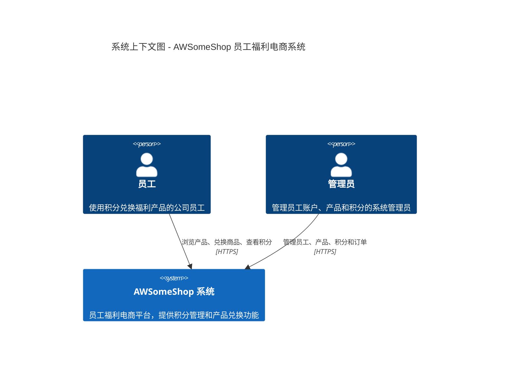
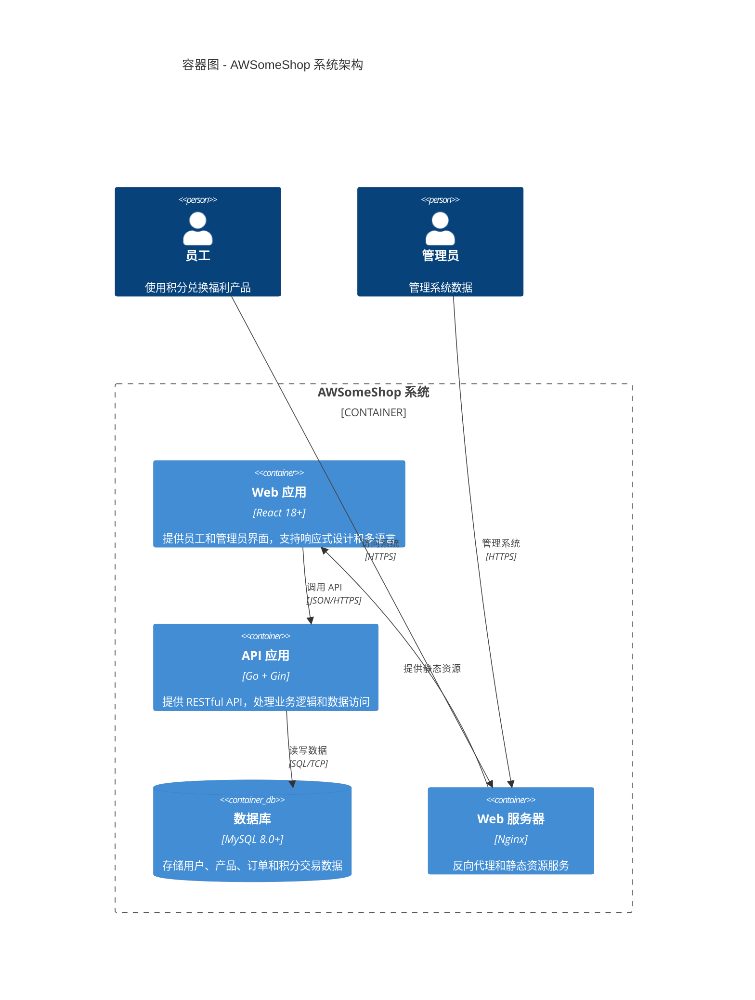
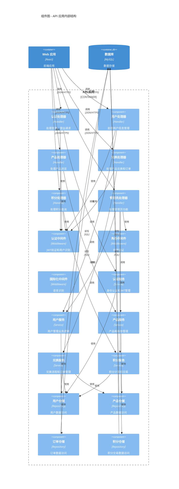
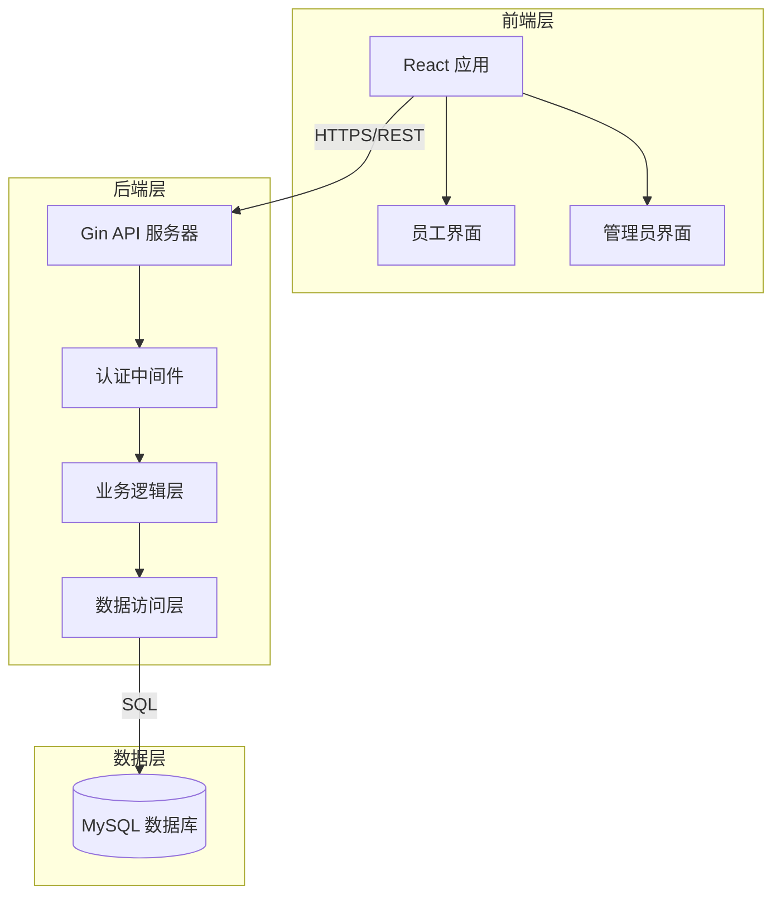
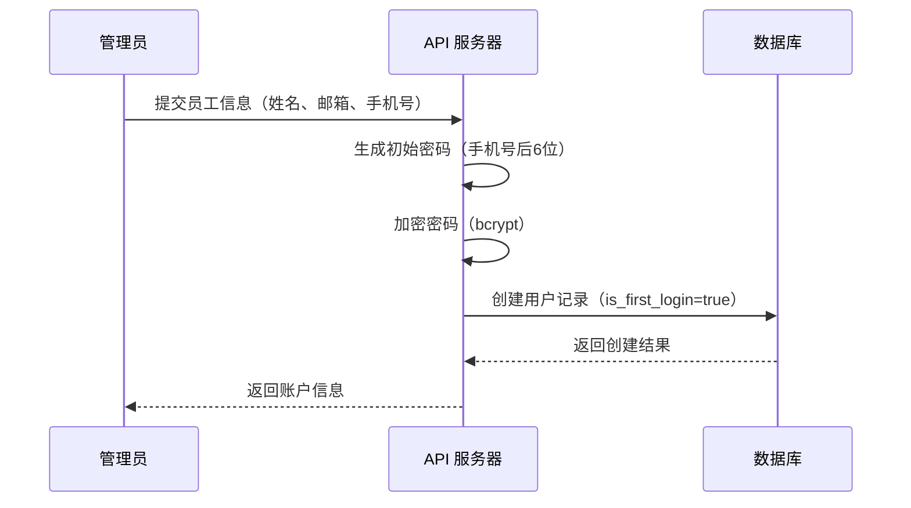
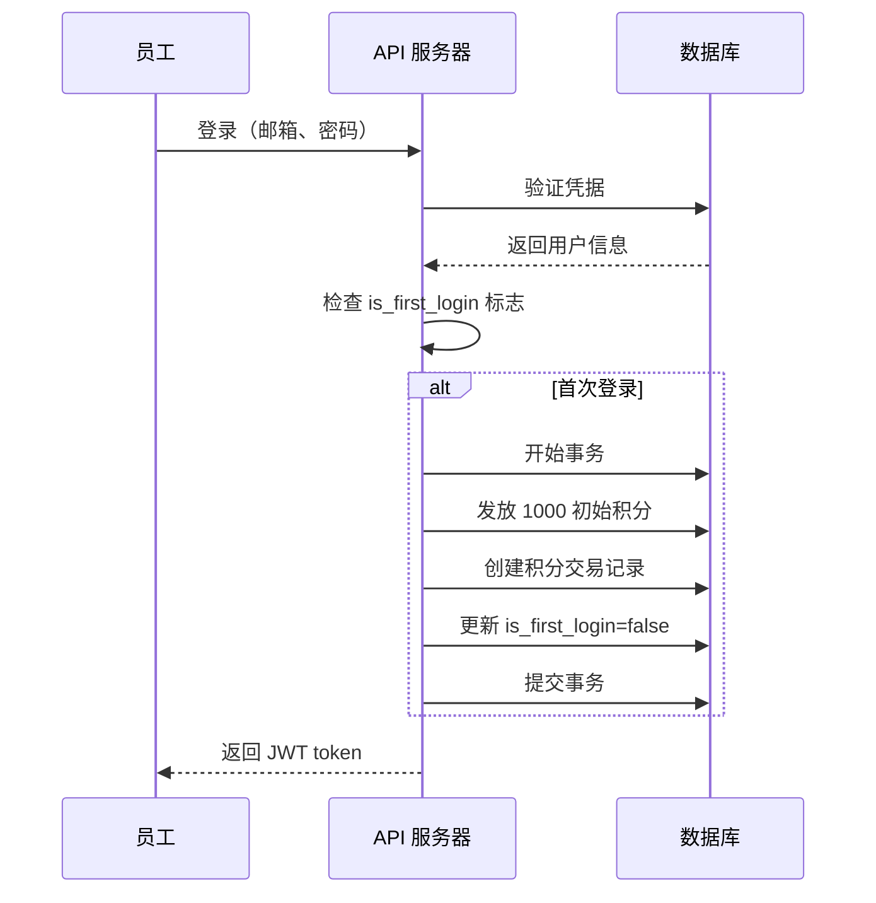
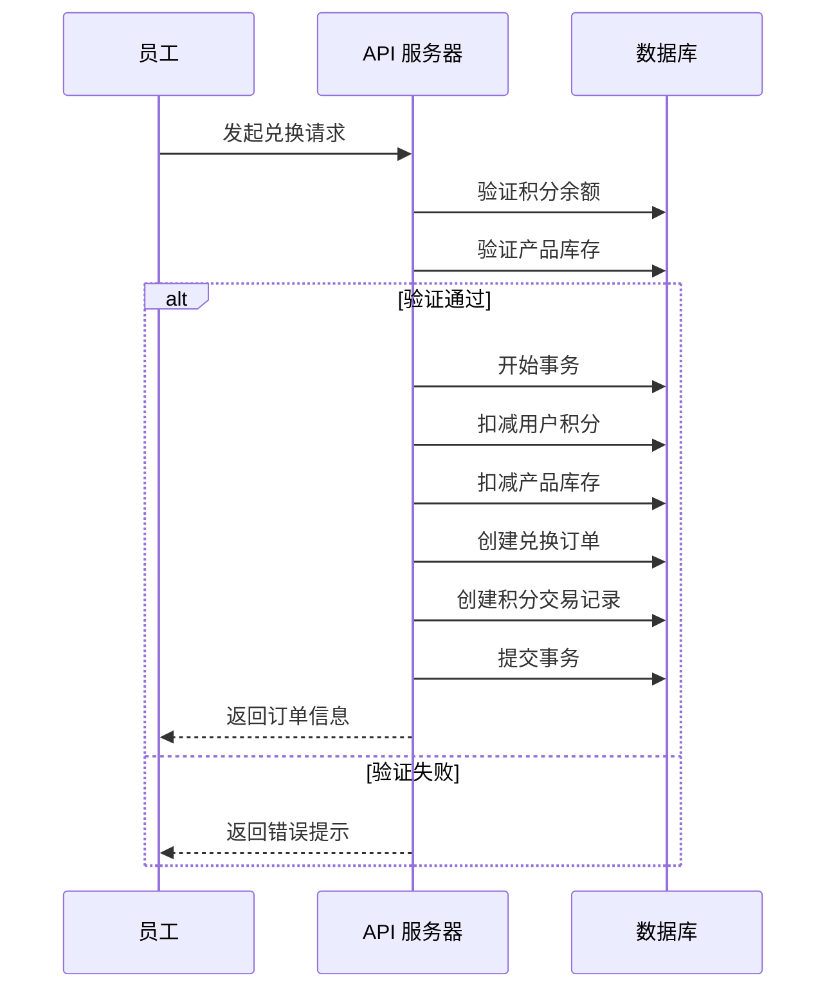
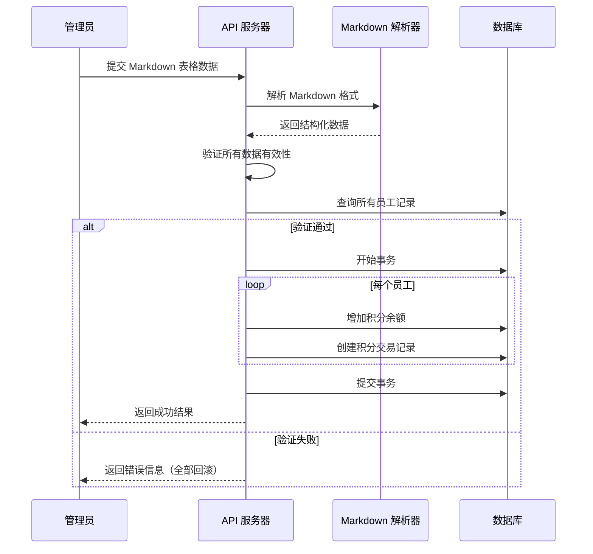
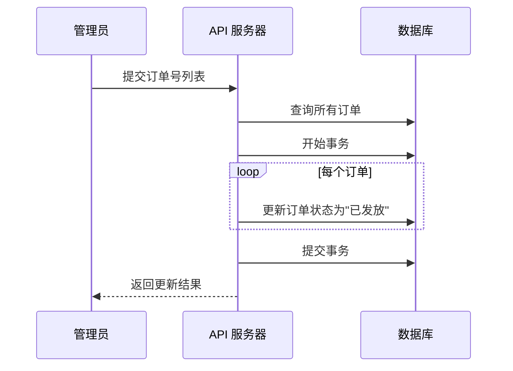

# 设计文档

## 概述

AWSomeShop 是一个基于 Web 的员工福利电商系统，采用前后端分离架构。系统使用 Go 语言和 Gin 框架构建后端 RESTful API，使用 React 构建响应式前端界面，使用 MySQL 作为持久化存储。

系统的核心功能包括：
- 员工积分管理和兑换系统
- 产品目录和库存管理（平铺展示，无分类）
- 订单处理和状态跟踪
- 多语言支持（中英双语）
- 管理员后台管理功能

系统设计遵循以下原则：
- **简单性**：MVP 阶段专注核心功能，避免过度设计
- **数据一致性**：使用数据库事务确保积分和库存的准确性
- **可扩展性**：模块化设计便于未来功能扩展
- **用户体验**：响应式设计支持移动端访问

## 架构

### C1: 系统上下文图（System Context）

展示AWSomeShop系统与外部用户和系统的交互关系。



### C2: 容器图（Container Diagram）

展示系统内的主要技术容器及其交互关系。



### C3: 组件图（Component Diagram）

展示API应用容器内的主要组件及其职责。



### 原有系统架构图（三层架构视图）

系统采用三层架构：



### 技术栈

**后端**
- 语言：Go 1.21+
- Web 框架：Gin
- ORM：GORM
- 数据库：MySQL 8.0+
- 身份认证：JWT (JSON Web Tokens)
- 密码加密：bcrypt
- 配置管理：Viper

**前端**
- 框架：React 18+
- 状态管理：React Context API
- HTTP 客户端：Axios
- UI 组件库：Ant Design
- 国际化：react-i18next
- 路由：React Router

**部署和运维**
- 容器化：Docker
- 反向代理：Nginx
- 日志：结构化日志（JSON 格式）

## 组件和接口

### 后端组件

#### 1. API 层 (Handler Layer)

负责处理 HTTP 请求和响应，进行输入验证和错误处理。

**主要 Handler：**
- `AuthHandler`：用户登录、登出
- `UserHandler`：用户信息管理、修改手机号
- `ProductHandler`：产品浏览
- `RedemptionHandler`：产品兑换、订单查询
- `PointsHandler`：积分查询、积分历史
- `AdminUserHandler`：员工账户管理（创建、离职处理）
- `AdminProductHandler`：产品管理（CRUD、上下架）
- `AdminPointsHandler`：积分发放、扣除、批量操作
- `AdminOrderHandler`：订单状态管理
- `AdminReportHandler`：统计报表查询

#### 2. 服务层 (Service Layer)

包含核心业务逻辑，协调多个数据访问操作。

**主要 Service：**
- `AuthService`：身份认证、JWT 生成和验证、密码加密
- `UserService`：用户管理、角色验证、首次登录处理
- `ProductService`：产品查询、库存管理
- `RedemptionService`：兑换流程、订单管理、库存扣减
- `PointsService`：积分计算、积分交易记录、批量发放

#### 3. 数据访问层 (Repository Layer)

负责数据库操作，使用 GORM 进行 ORM 映射。

**主要 Repository：**
- `UserRepository`：用户 CRUD 操作
- `ProductRepository`：产品 CRUD 操作
- `RedemptionOrderRepository`：订单 CRUD 操作
- `PointsTransactionRepository`：积分交易记录 CRUD 操作

#### 4. 中间件 (Middleware)

提供横切关注点的处理。

**主要 Middleware：**
- `AuthMiddleware`：JWT 验证、用户身份识别
- `RoleMiddleware`：角色权限验证（管理员权限检查）
- `CORSMiddleware`：跨域请求处理
- `LoggingMiddleware`：请求日志记录
- `RecoveryMiddleware`：panic 恢复

### 前端组件

#### 1. 页面组件 (Pages)

**员工端：**
- `LoginPage`：登录页面
- `ProductListPage`：产品列表页面（平铺展示）
- `RedemptionHistoryPage`：兑换历史页面
- `PointsHistoryPage`：积分历史页面
- `ProfilePage`：个人信息页面（修改手机号）

**管理员端：**
- `AdminDashboardPage`：管理员仪表板
- `AdminUserManagementPage`：员工账户管理页面
- `AdminProductManagementPage`：产品管理页面
- `AdminPointsManagementPage`：积分管理页面
- `AdminOrderManagementPage`：订单管理页面
- `AdminReportsPage`：统计报表页面

#### 2. 功能组件 (Components)

- `Header`：页面头部（导航、用户信息、语言切换）
- `ProductCard`：产品卡片（显示名称、图片、积分、库存状态）
- `PointsBalance`：积分余额显示
- `OrderStatusBadge`：订单状态标签（备货中、已发放）
- `DataTable`：通用数据表格
- `ConfirmDialog`：确认对话框
- `NotificationToast`：通知提示
- `MarkdownTableInput`：Markdown 表格输入组件（批量操作）

#### 3. 服务模块 (Services)

- `apiService`：封装 Axios，处理 API 请求
- `authService`：管理认证状态和 token
- `i18nService`：多语言切换
- `storageService`：本地存储管理

### API 接口设计

#### 认证接口

```
POST   /api/v1/auth/login         # 用户登录
POST   /api/v1/auth/logout        # 用户登出
GET    /api/v1/auth/me            # 获取当前用户信息
```

#### 用户接口

```
GET    /api/v1/users/profile      # 获取个人信息
PUT    /api/v1/users/phone        # 修改手机号
```

#### 产品接口

```
GET    /api/v1/products           # 获取产品列表（平铺展示）
```

#### 兑换接口

```
POST   /api/v1/redemptions        # 创建兑换订单
GET    /api/v1/redemptions        # 获取兑换历史
```

#### 积分接口

```
GET    /api/v1/points/balance     # 获取积分余额
GET    /api/v1/points/transactions # 获取积分交易历史（分页）
```

#### 管理员 - 用户管理接口

```
POST   /api/v1/admin/users              # 创建员工账户
PUT    /api/v1/admin/users/:id/status   # 设置员工离职状态
```

#### 管理员 - 产品管理接口

```
POST   /api/v1/admin/products           # 创建产品
PUT    /api/v1/admin/products/:id       # 更新产品
PUT    /api/v1/admin/products/:id/status # 上下架产品
POST   /api/v1/admin/products/batch     # 批量导入产品
```

#### 管理员 - 积分管理接口

```
POST   /api/v1/admin/points/grant       # 发放积分
POST   /api/v1/admin/points/deduct      # 扣除积分
POST   /api/v1/admin/points/batch-grant # 批量发放积分
```

#### 管理员 - 订单管理接口

```
GET    /api/v1/admin/orders              # 获取所有订单
PUT    /api/v1/admin/orders/batch-status # 批量更新订单状态
```

#### 管理员 - 报表接口

```
GET    /api/v1/admin/reports/points-grants    # 积分发放表
GET    /api/v1/admin/reports/points-balances  # 积分存量表
GET    /api/v1/admin/reports/redemptions      # 兑换记录表
```

## 数据模型

### 数据库表设计

#### 1. users（用户表）

```sql
CREATE TABLE users (
    id BIGINT PRIMARY KEY AUTO_INCREMENT,
    full_name VARCHAR(100) NOT NULL COMMENT '姓名',
    email VARCHAR(100) UNIQUE NOT NULL COMMENT '邮箱（唯一标识）',
    phone VARCHAR(20) NOT NULL COMMENT '手机号',
    password_hash VARCHAR(255) NOT NULL COMMENT '密码哈希',
    role ENUM('employee', 'admin') DEFAULT 'employee' COMMENT '角色',
    points_balance INT DEFAULT 0 COMMENT '积分余额',
    is_first_login BOOLEAN DEFAULT TRUE COMMENT '是否首次登录',
    is_active BOOLEAN DEFAULT TRUE COMMENT '账户是否有效',
    preferred_language VARCHAR(10) DEFAULT 'zh' COMMENT '首选语言',
    created_at TIMESTAMP DEFAULT CURRENT_TIMESTAMP,
    updated_at TIMESTAMP DEFAULT CURRENT_TIMESTAMP ON UPDATE CURRENT_TIMESTAMP,
    INDEX idx_email (email),
    INDEX idx_is_active (is_active)
) ENGINE=InnoDB DEFAULT CHARSET=utf8mb4 COMMENT='用户表';
```

#### 2. products（产品表）

```sql
CREATE TABLE products (
    id BIGINT PRIMARY KEY AUTO_INCREMENT,
    name VARCHAR(200) NOT NULL COMMENT '产品名称（包含中英文）',
    image_url VARCHAR(500) COMMENT '产品图片URL',
    points_required INT NOT NULL COMMENT '所需积分',
    stock_quantity INT DEFAULT 0 COMMENT '库存数量',
    status ENUM('active', 'inactive') DEFAULT 'active' COMMENT '状态（上架/下架）',
    created_at TIMESTAMP DEFAULT CURRENT_TIMESTAMP,
    updated_at TIMESTAMP DEFAULT CURRENT_TIMESTAMP ON UPDATE CURRENT_TIMESTAMP,
    INDEX idx_status (status)
) ENGINE=InnoDB DEFAULT CHARSET=utf8mb4 COMMENT='产品表';
```

#### 3. redemption_orders（兑换订单表）

```sql
CREATE TABLE redemption_orders (
    id BIGINT PRIMARY KEY AUTO_INCREMENT,
    order_number VARCHAR(50) UNIQUE NOT NULL COMMENT '订单号',
    user_id BIGINT NOT NULL COMMENT '用户ID',
    product_id BIGINT NOT NULL COMMENT '产品ID',
    product_name VARCHAR(200) NOT NULL COMMENT '产品名称快照',
    points_cost INT NOT NULL COMMENT '消耗积分',
    points_balance_after INT NOT NULL COMMENT '兑换后积分余额',
    status ENUM('preparing', 'delivered') DEFAULT 'preparing' COMMENT '订单状态',
    created_at TIMESTAMP DEFAULT CURRENT_TIMESTAMP,
    updated_at TIMESTAMP DEFAULT CURRENT_TIMESTAMP ON UPDATE CURRENT_TIMESTAMP,
    INDEX idx_user (user_id),
    INDEX idx_status (status),
    INDEX idx_created_at (created_at),
    FOREIGN KEY (user_id) REFERENCES users(id),
    FOREIGN KEY (product_id) REFERENCES products(id)
) ENGINE=InnoDB DEFAULT CHARSET=utf8mb4 COMMENT='兑换订单表';
```

#### 4. points_transactions（积分交易表）

```sql
CREATE TABLE points_transactions (
    id BIGINT PRIMARY KEY AUTO_INCREMENT,
    user_id BIGINT NOT NULL COMMENT '用户ID',
    transaction_type ENUM('grant', 'deduct', 'redemption') NOT NULL COMMENT '交易类型',
    amount INT NOT NULL COMMENT '变动数量（正数为增加，负数为减少）',
    balance_after INT NOT NULL COMMENT '交易后余额',
    reason VARCHAR(500) COMMENT '原因/备注',
    operator_id BIGINT COMMENT '操作员ID',
    related_order_id BIGINT COMMENT '关联订单ID',
    created_at TIMESTAMP DEFAULT CURRENT_TIMESTAMP,
    INDEX idx_user (user_id),
    INDEX idx_type (transaction_type),
    INDEX idx_created_at (created_at),
    FOREIGN KEY (user_id) REFERENCES users(id),
    FOREIGN KEY (operator_id) REFERENCES users(id),
    FOREIGN KEY (related_order_id) REFERENCES redemption_orders(id)
) ENGINE=InnoDB DEFAULT CHARSET=utf8mb4 COMMENT='积分交易表';
```

#### 5. product_price_history（产品价格历史表）

```sql
CREATE TABLE product_price_history (
    id BIGINT PRIMARY KEY AUTO_INCREMENT,
    product_id BIGINT NOT NULL COMMENT '产品ID',
    old_points INT COMMENT '旧积分价格',
    new_points INT NOT NULL COMMENT '新积分价格',
    operator_id BIGINT COMMENT '操作员ID',
    created_at TIMESTAMP DEFAULT CURRENT_TIMESTAMP,
    INDEX idx_product (product_id),
    FOREIGN KEY (product_id) REFERENCES products(id),
    FOREIGN KEY (operator_id) REFERENCES users(id)
) ENGINE=InnoDB DEFAULT CHARSET=utf8mb4 COMMENT='产品价格历史表';
```

### Go 数据模型

```go
// User 用户模型
type User struct {
    ID                uint      `gorm:"primaryKey" json:"id"`
    FullName          string    `gorm:"size:100;not null" json:"full_name"`
    Email             string    `gorm:"uniqueIndex;size:100;not null" json:"email"`
    Phone             string    `gorm:"size:20;not null" json:"phone"`
    PasswordHash      string    `gorm:"size:255;not null" json:"-"`
    Role              string    `gorm:"type:enum('employee','admin');default:'employee'" json:"role"`
    PointsBalance     int       `gorm:"default:0" json:"points_balance"`
    IsFirstLogin      bool      `gorm:"default:true" json:"is_first_login"`
    IsActive          bool      `gorm:"default:true" json:"is_active"`
    PreferredLanguage string    `gorm:"size:10;default:'zh'" json:"preferred_language"`
    CreatedAt         time.Time `json:"created_at"`
    UpdatedAt         time.Time `json:"updated_at"`
}

// Product 产品模型
type Product struct {
    ID             uint      `gorm:"primaryKey" json:"id"`
    Name           string    `gorm:"size:200;not null" json:"name"`
    ImageURL       string    `gorm:"size:500" json:"image_url"`
    PointsRequired int       `gorm:"not null" json:"points_required"`
    StockQuantity  int       `gorm:"default:0" json:"stock_quantity"`
    Status         string    `gorm:"type:enum('active','inactive');default:'active'" json:"status"`
    CreatedAt      time.Time `json:"created_at"`
    UpdatedAt      time.Time `json:"updated_at"`
}

// RedemptionOrder 兑换订单模型
type RedemptionOrder struct {
    ID                 uint      `gorm:"primaryKey" json:"id"`
    OrderNumber        string    `gorm:"uniqueIndex;size:50;not null" json:"order_number"`
    UserID             uint      `gorm:"not null" json:"user_id"`
    User               User      `gorm:"foreignKey:UserID" json:"user,omitempty"`
    ProductID          uint      `gorm:"not null" json:"product_id"`
    Product            Product   `gorm:"foreignKey:ProductID" json:"product,omitempty"`
    ProductName        string    `gorm:"size:200;not null" json:"product_name"`
    PointsCost         int       `gorm:"not null" json:"points_cost"`
    PointsBalanceAfter int       `gorm:"not null" json:"points_balance_after"`
    Status             string    `gorm:"type:enum('preparing','delivered');default:'preparing'" json:"status"`
    CreatedAt          time.Time `json:"created_at"`
    UpdatedAt          time.Time `json:"updated_at"`
}

// PointsTransaction 积分交易模型
type PointsTransaction struct {
    ID              uint              `gorm:"primaryKey" json:"id"`
    UserID          uint              `gorm:"not null" json:"user_id"`
    User            User              `gorm:"foreignKey:UserID" json:"user,omitempty"`
    TransactionType string            `gorm:"type:enum('grant','deduct','redemption');not null" json:"transaction_type"`
    Amount          int               `gorm:"not null" json:"amount"`
    BalanceAfter    int               `gorm:"not null" json:"balance_after"`
    Reason          string            `gorm:"size:500" json:"reason"`
    OperatorID      *uint             `json:"operator_id"`
    Operator        *User             `gorm:"foreignKey:OperatorID" json:"operator,omitempty"`
    RelatedOrderID  *uint             `json:"related_order_id"`
    RelatedOrder    *RedemptionOrder  `gorm:"foreignKey:RelatedOrderID" json:"related_order,omitempty"`
    CreatedAt       time.Time         `json:"created_at"`
}

// ProductPriceHistory 产品价格历史模型
type ProductPriceHistory struct {
    ID         uint      `gorm:"primaryKey" json:"id"`
    ProductID  uint      `gorm:"not null" json:"product_id"`
    Product    Product   `gorm:"foreignKey:ProductID" json:"product,omitempty"`
    OldPoints  *int      `json:"old_points"`
    NewPoints  int       `gorm:"not null" json:"new_points"`
    OperatorID *uint     `json:"operator_id"`
    Operator   *User     `gorm:"foreignKey:OperatorID" json:"operator,omitempty"`
    CreatedAt  time.Time `json:"created_at"`
}
```

### 关键业务流程

#### 1. 管理员创建员工账户流程



#### 2. 员工首次登录流程



#### 3. 产品兑换流程



#### 4. 批量发放积分流程



#### 5. 批量更新订单状态流程



## 正确性属性

*属性是一个特征或行为，应该在系统的所有有效执行中保持为真——本质上是关于系统应该做什么的正式陈述。属性作为人类可读规范和机器可验证正确性保证之间的桥梁。*

